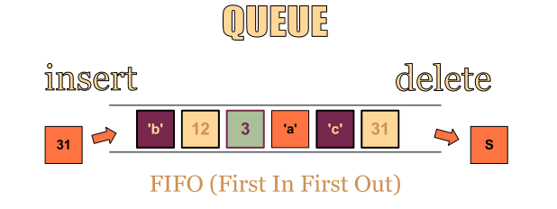

# QUEUES

-Queue is an abstract data structure which is somewhat similar to stacks.

-Queue uses ***FIRST IN FIRST OUT (FIFO)*** approch.
  
  
-A queue is open at its both ends,one end is always used to insert and another to remove data.

### Types Of Queue
- Queues
    - Simple queue
    - Circular queue
    - Priority queue
    - Double ended queue
  
     
   
  
  
